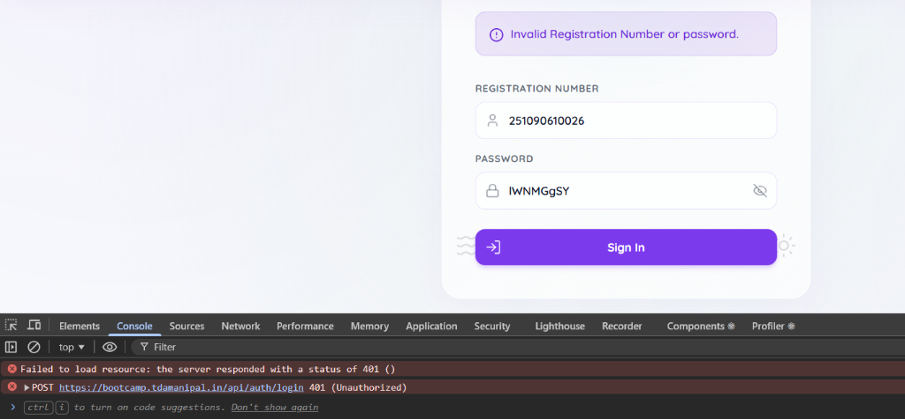
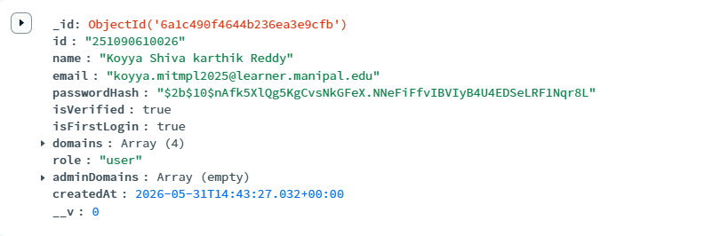

# 🌊 TDA Bootcamp '26 Portal

> A unified learning hub, progress tracker, and live leaderboard platform for the **Data Alchemists (TDA) Bootcamp '26**.

---

## 📖 Motivation

Coordinating a bootcamp for **400+ participants** across 5 learning tracks (**DSA, DAV, ML/DL, Gen & Agentic AI, and WebDev**) introduces significant administrative challenges:
*   **Information Silos:** Distributing curriculum materials and tracking weekly locks via messaging groups becomes chaotic.
*   **Data Integrity & Scientific Notation:** Grading cohorts using Excel spreadsheets often causes formatting corruption. When exporting data, 12-digit student IDs frequently get converted into scientific strings (e.g. `2.51e10`), rendering them unmatchable.
*   **Registration Aliases:** Students registering with variations of domain names (like `GenAi` instead of `Gen & Agentic AI`) get missed by database queries.

The **TDA Bootcamp '26 Portal** resolves these operational overheads. It provides students with a single glassmorphic dashboard to track their weekly assignments and domain progress, and offers admins a robust CSV import engine that automatically normalizes user registry aliases, resolves Excel notation issues, and preserves rankings.

---

## 📸 Portal in Action

### 1. Unified Student Domain Workspace


### 2. Standings & Leaderboard Rankings


---

## ✨ Core Features

*   **🎓 Multi-Track Curriculum:** Structured week-by-week curriculum resources for all 5 domains.
*   **🔒 Granular Week Lock System:** Domain heads can lock/unlock individual week contents to pace learning.
*   **📊 Dynamic Standings:** Display of overall and weekly rankings showing the top 10 positions, highlighting the active user's position in-line or at the bottom.
*   **⚡ Smart CSV Processor:** Upload rankings with automatic Excel scientific notation resolution, case-insensitive lookup fallbacks, and alias matching (e.g. mapping `GenAi` -> `Gen & Agentic AI`).
*   **🔔 Announcement Feed:** Real-time cohort broadcast channel managed by administrators.

---

## 🛠️ Tech Stack

*   **Frontend:** React (Vite, TailwindCSS, Lucide Icons)
*   **Backend:** Node.js (Express)
*   **Database:** MongoDB Atlas (Mongoose ODM)

---

## 🚀 Quick Start

### 1. Prerequisites
Ensure you have Node.js and MongoDB installed, then create a `.env` file in the `backend/` directory:
```env
PORT=5000
MONGO_URI=mongodb+srv://<user>:<password>@cluster.mongodb.net/tda
JWT_SECRET=your_secret_key
```

### 2. Installation
Install dependencies in the root directory:
```bash
npm install
```

### 3. Running Locally
Run the concurrent dev script:
```bash
npm run dev
```
The client runs on `http://localhost:5173` and the backend runs on `http://localhost:5000`.

---

## 💡 Usage Example: Leaderboard Validation

Admins can validate leaderboard files locally using the **Dry-Run Validation CLI tool** before committing edits to the live production database. This matches names, checks registration IDs, and previews calculated standings safely in read-only mode:

```bash
# syntax: node backend/dry-run-leaderboard.js <file> <type: weekly|overall> <domain> [week]

# Example: Validate Week 1 rankings for Gen & Agentic AI
node backend/dry-run-leaderboard.js GenAI-weekly.csv weekly "Gen & Agentic AI" 1
```

### Output Preview:
```
=== Starting Dry Run for WEEKLY Leaderboard ===
CSV Path: .../GenAI-weekly.csv
Domain:   Gen & Agentic AI
Week:     1
Connecting to database...
Connected to MongoDB.

Successfully parsed CSV. Found 10 rows.

=== DRY RUN RESULTS ===
Successfully matched: 10 / 10
Skipped (with errors): 0 / 10

--- Computed Database Payload Preview ---
┌─────────┬──────┬────────────────┬────────────────────────┬───────┬──────┐
│ (index) │ Rank │ Reg No         │ Name                   │ Score │ Week │
├─────────┼──────┼────────────────┼────────────────────────┼───────┼──────┤
│ 0       │ 1    │ '251090051122' │ 'Saksham Srivastava'   │ 10    │ 1    │
│ 1       │ 2    │ '251090290042' │ 'Aryaa Bhavsar'        │ 10    │ 1    │
│ 2       │ 3    │ '240968302'    │ 'Avni Thakral'         │ 10    │ 1    │
└─────────┴──────┴────────────────┴────────────────────────┴───────┴──────┘
[SUCCESS] Dry run completed. Database was NOT modified.
```
